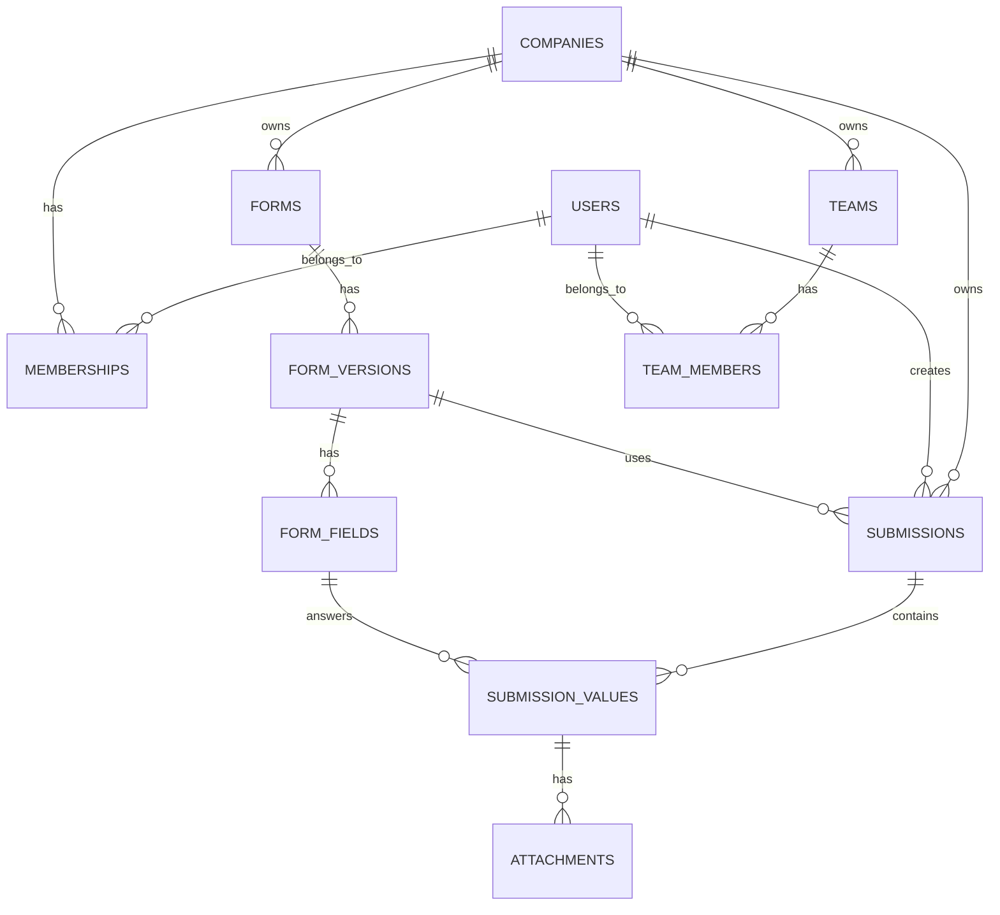

# DER - Smart Audit

## Objetivo

Este documento consolida o modelo de dados do Smart Audit.

Ele suporta:

- multiempresa (multi-tenant por `company_id`)
- autenticação e associação por empresa
- formulários versionados
- execução de inspeções
- respostas tipadas por campo
- anexos de evidências
- equipes e membros por empresa

## Decisões de modelagem

- Usar `UUID` como chave primária em todas as entidades (gerado pelo PostgreSQL via `gen_random_uuid()`).
- Manter isolamento por `company_id` nas tabelas de domínio operacional.
- Separar `form` de `form_version` para preservar histórico.
- Separar `submission` do template original usado na execução.
- Usar modelo híbrido:
  - dados estruturados em `submission_values`
  - snapshot otimizado em `submissions.answers_json`
- Guardar arquivos fora do banco; `attachments` armazena apenas metadados.
- `teams` e `team_members` implementados como bounded context próprio.

## Entidades e Relacionamentos

### Contexto de acesso

- `users` — identidade global do usuário
- `companies` — tenant/cliente
- `memberships` — liga usuário a empresa com papel de acesso (`OWNER`, `ADMIN`, `MANAGER`, `INSPECTOR`, `VIEWER`)

Relacionamentos:

- `companies 1:N memberships`
- `users 1:N memberships`

### Contexto de formulários

- `forms` — checklist/formulário lógico
- `form_versions` — versão congelada do formulário
- `form_fields` — campos de uma versão específica

Relacionamentos:

- `companies 1:N forms`
- `forms 1:N form_versions`
- `form_versions 1:N form_fields`

### Contexto de inspeções

- `submissions` — execução de uma inspeção
- `submission_values` — resposta de cada campo na execução
- `attachments` — evidências associadas a uma resposta

Relacionamentos:

- `companies 1:N submissions`
- `users 1:N submissions`
- `form_versions 1:N submissions`
- `submissions 1:N submission_values`
- `form_fields 1:N submission_values`
- `submission_values 1:N attachments`

### Contexto de equipes

- `teams` — equipe dentro de uma empresa
- `team_members` — associação entre equipe e usuário

Relacionamentos:

- `companies 1:N teams`
- `teams 1:N team_members`
- `users 1:N team_members`

## DER textual

```text
users
  └─< memberships >─ companies
                        │
                        ├─< forms
                        │    └─< form_versions
                        │         └─< form_fields
                        │
                        ├─< submissions >─ users
                        │      │
                        │      ├─ form_versions
                        │      └─< submission_values >─ form_fields
                        │             └─< attachments
                        │
                        └─< teams
                               └─< team_members >─ users
```

## DER em Mermaid



## Tabelas

### `users`

Finalidade: identidade global do usuário.

Campos:

- `id UUID PK`
- `name VARCHAR(150)`
- `email VARCHAR(255) UNIQUE`
- `password_hash VARCHAR(255)` — formato `pbkdf2_sha256$iterations$salt$digest`
- `is_active BOOLEAN`
- `created_at TIMESTAMPTZ`
- `updated_at TIMESTAMPTZ`

Observações:

- Email único globalmente.
- Hash PBKDF2-SHA256 customizado — não trocar por bcrypt sem migração.

---

### `companies`

Finalidade: tenant lógico do sistema.

Campos:

- `id UUID PK`
- `name VARCHAR(150)`
- `slug VARCHAR(120) UNIQUE`
- `plan VARCHAR(50)`
- `is_active BOOLEAN`
- `created_at TIMESTAMPTZ`
- `updated_at TIMESTAMPTZ`

---

### `memberships`

Finalidade: associação entre usuário e empresa com papel de acesso.

Campos:

- `id UUID PK`
- `company_id UUID FK -> companies.id ON DELETE CASCADE`
- `user_id UUID FK -> users.id ON DELETE CASCADE`
- `role VARCHAR(30)`
- `created_at TIMESTAMPTZ`

Restrições:

- `UNIQUE(company_id, user_id)`
- `CHECK (role IN ('OWNER', 'ADMIN', 'MANAGER', 'INSPECTOR', 'VIEWER'))`

---

### `forms`

Finalidade: entidade lógica do checklist (não muda após criação).

Campos:

- `id UUID PK`
- `company_id UUID FK -> companies.id`
- `name VARCHAR(180)`
- `description TEXT NULL`
- `is_active BOOLEAN`
- `created_by UUID FK -> users.id`
- `created_at TIMESTAMPTZ`
- `updated_at TIMESTAMPTZ`

Índices:

- `ix_forms_company_id`

---

### `form_versions`

Finalidade: congelar alterações do formulário em versões independentes.

Campos:

- `id UUID PK`
- `form_id UUID FK -> forms.id`
- `version INTEGER`
- `status VARCHAR(20)` — `draft | published | archived`
- `published_at TIMESTAMPTZ NULL`
- `created_by UUID FK -> users.id`
- `created_at TIMESTAMPTZ`

Restrições:

- `UNIQUE(form_id, version)`

---

### `form_fields`

Finalidade: itens/campos de cada versão do formulário.

Campos:

- `id UUID PK`
- `form_version_id UUID FK -> form_versions.id`
- `key VARCHAR(100)`
- `label VARCHAR(180)`
- `field_type VARCHAR(30)` — `boolean | text | number | select | date | photo`
- `required BOOLEAN`
- `position INTEGER`
- `config_json JSONB` — opções, limites, placeholders, regras específicas
- `created_at TIMESTAMPTZ`
- `updated_at TIMESTAMPTZ`

Restrições:

- `UNIQUE(form_version_id, key)`
- `UNIQUE(form_version_id, position)`

---

### `submissions`

Finalidade: execução de uma inspeção para uma versão específica de formulário.

Campos:

- `id UUID PK`
- `company_id UUID FK -> companies.id`
- `form_id UUID FK -> forms.id`
- `form_version_id UUID FK -> form_versions.id`
- `created_by UUID FK -> users.id`
- `status VARCHAR(20)` — `draft | in_progress | completed | cancelled`
- `score NUMERIC(5,2) NULL`
- `started_at TIMESTAMPTZ`
- `finished_at TIMESTAMPTZ NULL`
- `answers_json JSONB` — snapshot desnormalizado para leitura rápida
- `created_at TIMESTAMPTZ`
- `updated_at TIMESTAMPTZ`

Índices:

- `ix_submissions_company_id`
- `ix_submissions_form_version_id`
- `ix_submissions_created_by`
- `ix_submissions_status`

---

### `submission_values`

Finalidade: resposta estruturada por campo dentro da inspeção.

Campos:

- `id UUID PK`
- `submission_id UUID FK -> submissions.id ON DELETE CASCADE`
- `form_field_id UUID FK -> form_fields.id`
- `value_text TEXT NULL`
- `value_number NUMERIC(14,4) NULL`
- `value_boolean BOOLEAN NULL`
- `value_date DATE NULL`
- `value_json JSONB NULL` — usado para `select` e tipos estruturados
- `created_at TIMESTAMPTZ`
- `updated_at TIMESTAMPTZ`

Restrições:

- `UNIQUE(submission_id, form_field_id)`

---

### `attachments`

Finalidade: evidências de uma resposta específica.

Campos:

- `id UUID PK`
- `submission_value_id UUID FK -> submission_values.id ON DELETE CASCADE`
- `file_url TEXT` — URL pública gerada pelo endpoint `/uploads`
- `thumbnail_url TEXT NULL`
- `mime_type VARCHAR(120)`
- `file_size BIGINT`
- `uploaded_by UUID FK -> users.id`
- `created_at TIMESTAMPTZ`

Índices:

- `ix_attachments_submission_value_id`
- `ix_attachments_uploaded_by`

---

### `teams`

Finalidade: agrupar usuários de uma empresa em equipes.

Campos:

- `id UUID PK`
- `company_id UUID FK -> companies.id ON DELETE CASCADE`
- `name VARCHAR(150)`
- `created_by UUID FK -> users.id`
- `created_at TIMESTAMPTZ`
- `updated_at TIMESTAMPTZ`

Índices:

- `ix_teams_company_id`

---

### `team_members`

Finalidade: associação entre equipe e usuário (N:N com metadados).

Campos:

- `id UUID PK`
- `team_id UUID FK -> teams.id ON DELETE CASCADE`
- `user_id UUID FK -> users.id ON DELETE CASCADE`
- `created_at TIMESTAMPTZ`
- `updated_at TIMESTAMPTZ`

Restrições:

- `UNIQUE(team_id, user_id)` — `uq_team_members_team_user`

Índices:

- `ix_team_members_team_id`
- `ix_team_members_user_id`

---

## Regras de consistência importantes

### Isolamento por empresa

Toda query operacional valida `company_id`. Exemplos:

- formulários listados sempre filtrados pela empresa ativa
- inspeções sempre filtradas pela empresa ativa
- equipes sempre filtradas pela empresa ativa
- validação de acesso do usuário via `memberships`

### Versionamento

- Formulários nunca devem ser alterados retroativamente em versões publicadas.
- Toda alteração estrutural relevante gera nova linha em `form_versions`.
- `submissions` sempre apontam para a versão usada no momento da execução.

### Snapshot `answers_json`

`answers_json` é um cache de leitura da inspeção.

- Fonte de verdade: `submission_values`
- Uso do snapshot: leitura rápida na tela, listagem resumida, exportação simples
- Ambos são escritos atomicamente em `SubmissionService.save_answers` — nunca atualizar um sem o outro.

### Anexos

- Anexos dependem de um `submission_value` existente.
- O banco não armazena binário do arquivo.
- Arquivo gravado em `<upload_dir>/<company_id>/<uuid>.<ext>` via `POST /uploads`.
- `POST /attachments` registra os metadados e vincula ao campo.

## Migrations

| Arquivo | Descrição |
|---|---|
| `332b89327dc7_initial_schema.py` | Schema inicial: users, companies, memberships, forms, form_versions, form_fields, submissions, submission_values, attachments |
| `8aeb51c1026f_add_updated_at_to_metadata_tables.py` | Adiciona `updated_at` às tabelas de metadados |
| `f73cae8e6de7_add_teams_and_team_members.py` | Adiciona teams e team_members |

## Evolução futura

Tabelas não implementadas, com espaço arquitetural previsto:

- `audit_logs` — rastreabilidade de eventos por empresa
- `reports` — snapshots de relatórios gerados
- `corrective_actions` — ações corretivas vinculadas a inspeções
- `sync_queue` — fila local para offline-first
