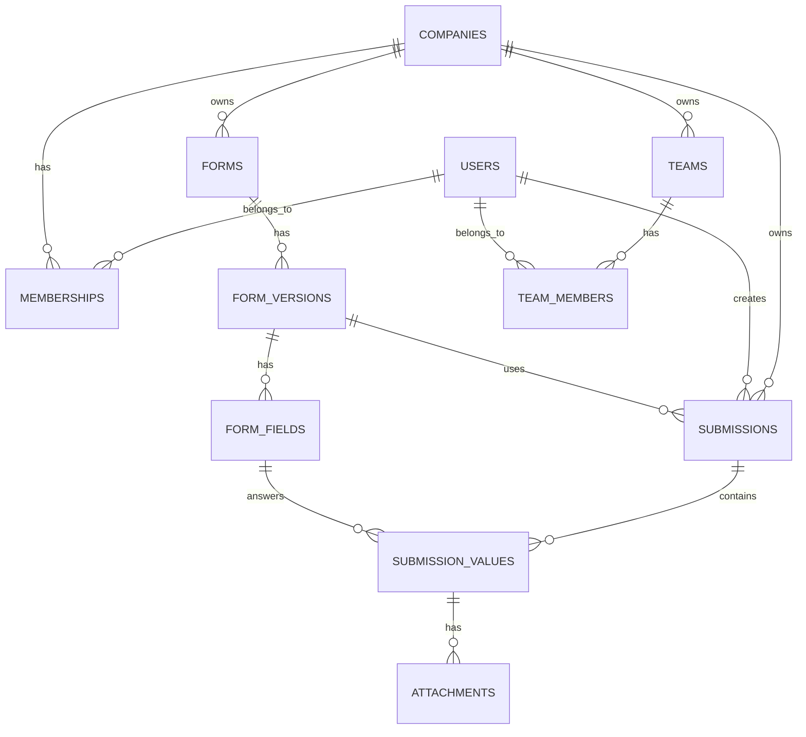

# DER - Smart Audit

## Objetivo

Este documento consolida o modelo de dados real do Smart Audit no estado atual do projeto.

Ele sustenta:

- multiempresa por `company_id`
- autenticacao e memberships por empresa
- formularios versionados
- execucao de inspecoes
- respostas tipadas por campo
- anexos de evidencias
- equipes e membros por empresa

## Decisoes de modelagem

- todas as entidades principais usam `UUID`
- o isolamento operacional acontece por `company_id`
- `form` e separado de `form_version`
- `submission` aponta para a versao efetivamente usada
- respostas usam modelo hibrido:
  - relacional em `submission_values`
  - snapshot em `submissions.answers_json`
- arquivos ficam fora do banco; `attachments` armazena apenas metadados
- equipes foram promovidas ao modelo real do sistema

## Contextos e relacionamentos

### Acesso

- `users`
- `companies`
- `memberships`

Relacionamentos:

- `companies 1:N memberships`
- `users 1:N memberships`

### Formularios

- `forms`
- `form_versions`
- `form_fields`

Relacionamentos:

- `companies 1:N forms`
- `forms 1:N form_versions`
- `form_versions 1:N form_fields`

### Inspecoes

- `submissions`
- `submission_values`
- `attachments`

Relacionamentos:

- `companies 1:N submissions`
- `users 1:N submissions`
- `form_versions 1:N submissions`
- `submissions 1:N submission_values`
- `form_fields 1:N submission_values`
- `submission_values 1:N attachments`

### Equipes

- `teams`
- `team_members`

Relacionamentos:

- `companies 1:N teams`
- `teams 1:N team_members`
- `users 1:N team_members`

## DER textual

```text
users
  `-< memberships >- companies
                        |
                        |-< forms
                        |    `-< form_versions
                        |         `-< form_fields
                        |
                        |-< submissions >- users
                        |      |
                        |      |- form_versions
                        |      `-< submission_values >- form_fields
                        |             `-< attachments
                        |
                        `-< teams
                               `-< team_members >- users
```

## DER em Mermaid



## Tabelas

### `users`

- `id UUID PK`
- `name VARCHAR(150)`
- `email VARCHAR(255) UNIQUE`
- `password_hash VARCHAR(255)`
- `is_active BOOLEAN`
- `created_at TIMESTAMPTZ`
- `updated_at TIMESTAMPTZ`

Observacoes:

- email e unico globalmente
- `password_hash` usa formato PBKDF2-SHA256 customizado

### `companies`

- `id UUID PK`
- `name VARCHAR(150)`
- `slug VARCHAR(120) UNIQUE`
- `plan VARCHAR(50)`
- `is_active BOOLEAN`
- `created_at TIMESTAMPTZ`
- `updated_at TIMESTAMPTZ`

### `memberships`

- `id UUID PK`
- `company_id UUID FK -> companies.id`
- `user_id UUID FK -> users.id`
- `role VARCHAR(30)`
- `created_at TIMESTAMPTZ`
- `updated_at TIMESTAMPTZ`

Restricoes:

- `UNIQUE(company_id, user_id)`
- `CHECK role IN ('OWNER', 'ADMIN', 'MANAGER', 'INSPECTOR', 'VIEWER')`

### `forms`

- `id UUID PK`
- `company_id UUID FK -> companies.id`
- `name VARCHAR(180)`
- `description TEXT NULL`
- `is_active BOOLEAN`
- `created_by UUID FK -> users.id`
- `created_at TIMESTAMPTZ`
- `updated_at TIMESTAMPTZ`

### `form_versions`

- `id UUID PK`
- `form_id UUID FK -> forms.id`
- `version INTEGER`
- `status VARCHAR(20)`
- `published_at TIMESTAMPTZ NULL`
- `created_by UUID FK -> users.id`
- `created_at TIMESTAMPTZ`
- `updated_at TIMESTAMPTZ`

Restricoes:

- `UNIQUE(form_id, version)`

### `form_fields`

- `id UUID PK`
- `form_version_id UUID FK -> form_versions.id`
- `key VARCHAR(100)`
- `label VARCHAR(180)`
- `field_type VARCHAR(30)`
- `required BOOLEAN`
- `position INTEGER`
- `config_json JSONB`
- `created_at TIMESTAMPTZ`
- `updated_at TIMESTAMPTZ`

Restricoes:

- `UNIQUE(form_version_id, key)`
- `UNIQUE(form_version_id, position)`

Tipos de campo atualmente suportados:

- `boolean`
- `text`
- `number`
- `select`
- `date`
- `photo`

### `submissions`

- `id UUID PK`
- `company_id UUID FK -> companies.id`
- `form_version_id UUID FK -> form_versions.id`
- `created_by UUID FK -> users.id`
- `status VARCHAR(20)`
- `score NUMERIC(5,2) NULL`
- `started_at TIMESTAMPTZ`
- `finished_at TIMESTAMPTZ NULL`
- `answers_json JSONB`
- `created_at TIMESTAMPTZ`
- `updated_at TIMESTAMPTZ`

Observacoes:

- `status` hoje cobre `draft | in_progress | completed | cancelled`
- o frontend e o backend usam esse estado tambem para dashboard, busca e notificacoes derivadas

### `submission_values`

- `id UUID PK`
- `submission_id UUID FK -> submissions.id`
- `form_field_id UUID FK -> form_fields.id`
- `value_text TEXT NULL`
- `value_number NUMERIC(14,4) NULL`
- `value_boolean BOOLEAN NULL`
- `value_date DATE NULL`
- `value_json JSONB NULL`
- `created_at TIMESTAMPTZ`
- `updated_at TIMESTAMPTZ`

Restricoes:

- `UNIQUE(submission_id, form_field_id)`

### `attachments`

- `id UUID PK`
- `submission_value_id UUID FK -> submission_values.id`
- `file_url TEXT`
- `thumbnail_url TEXT NULL`
- `mime_type VARCHAR(120)`
- `file_size BIGINT`
- `uploaded_by UUID FK -> users.id`
- `created_at TIMESTAMPTZ`
- `updated_at TIMESTAMPTZ`

### `teams`

- `id UUID PK`
- `company_id UUID FK -> companies.id`
- `name VARCHAR(150)`
- `created_by UUID FK -> users.id`
- `created_at TIMESTAMPTZ`
- `updated_at TIMESTAMPTZ`

### `team_members`

- `id UUID PK`
- `team_id UUID FK -> teams.id`
- `user_id UUID FK -> users.id`
- `created_at TIMESTAMPTZ`
- `updated_at TIMESTAMPTZ`

Restricoes:

- `UNIQUE(team_id, user_id)`

## Regras de consistencia

### Isolamento por empresa

Toda query de dominio filtra por `company_id` com base no membership atual.

Isso vale para:

- usuarios da empresa
- formularios
- inspecoes
- equipes
- evidencias e uploads

### Versionamento

- formularios publicados nao sao editados retroativamente
- uma mudanca estrutural relevante gera nova `form_version`
- cada `submission` fica congelada na versao usada no momento da execucao

### Snapshot `answers_json`

- fonte estruturada: `submission_values`
- leitura otimizada: `answers_json`
- ambos sao mantidos no fluxo de `save_answers`

### Uploads e anexos

- o arquivo e salvo fora do banco
- o endpoint de upload devolve URL publica
- `attachments` liga essa URL a um campo respondido da inspecao

## Artefatos relacionados

Migracoes observadas no projeto:

- `332b89327dc7_initial_schema.py`
- `8aeb51c1026f_add_updated_at_to_metadata_tables.py`
- `f73cae8e6de7_add_teams_and_team_members.py`

## Evolucao futura prevista

Ainda nao implementados como tabela/modulo consolidado:

- `audit_logs`
- `corrective_actions`
- `reports` mais amplos
- estrutura de sync offline
