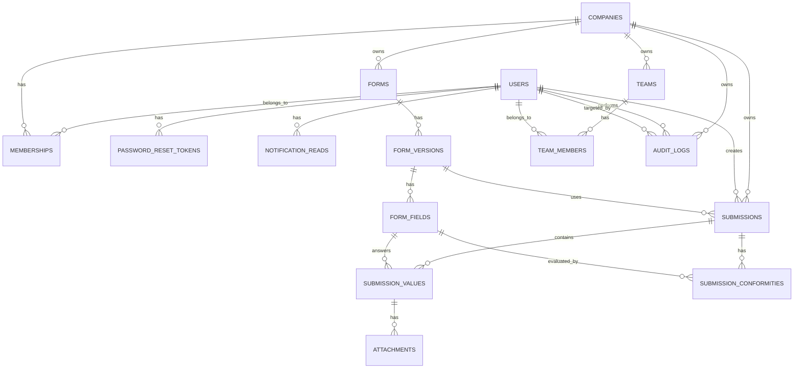

# DER - Smart Audit

## Objetivo

Este documento consolida o modelo de dados real do Smart Audit no estado atual do projeto.

Ele sustenta:

- multiempresa por `company_id`
- autenticacao e memberships por empresa com soft delete via `revoked_at`
- recuperacao de senha com token de uso unico
- formularios versionados com tipos de campo extendidos e configuracao via JSONB
- execucao de inspecoes com score ponderado e respostas N/A
- respostas tipadas por campo com suporte a regras condicionais
- anexos de evidencias
- equipes e membros por empresa com soft delete via `is_active`

## Decisoes de modelagem

- todas as entidades principais usam `UUID`
- o isolamento operacional acontece por `company_id`
- `form` e separado de `form_version`
- `submission` aponta para a versao efetivamente usada
- respostas usam modelo hibrido:
  - relacional em `submission_values`
  - snapshot em `submissions.answers_json`
- arquivos ficam fora do banco; `attachments` armazena apenas metadados
- equipes foram promovidas ao modelo real do sistema
- **nao existe tabela de notificacoes**: notificacoes sao derivadas em tempo real de `submissions` pelo servico
- o estado de leitura e dismiss e armazenado em `notification_reads` com chave deterministica por usuario
- configuracao especifica de campo (peso, allow_na, opcoes) fica em `form_fields.config_json`
- valor N/A em campos booleanos e armazenado como `value_text = "na"` com `value_boolean = NULL`
- campos do tipo `section` nao geram `submission_value`
- soft delete de membership via `revoked_at TIMESTAMPTZ NULL` — preserva historico de inspecoes
- soft delete de team via `is_active BOOLEAN` — equipes desativadas nao aparecem na listagem

## Contextos e relacionamentos

### Acesso

- `users`
- `companies`
- `memberships`
- `password_reset_tokens`
- `notification_reads`

Relacionamentos:

- `companies 1:N memberships`
- `users 1:N memberships`
- `users 1:N password_reset_tokens`
- `users 1:N notification_reads`

### Formularios

- `forms`
- `form_versions`
- `form_fields`

Relacionamentos:

- `companies 1:N forms`
- `forms 1:N form_versions`
- `form_versions 1:N form_fields`

### Inspecoes

- `submissions`
- `submission_values`
- `submission_conformities`
- `attachments`

Relacionamentos:

- `companies 1:N submissions`
- `users 1:N submissions`
- `form_versions 1:N submissions`
- `submissions 1:N submission_values`
- `form_fields 1:N submission_values`
- `submission_values 1:N attachments`
- `submissions 1:N submission_conformities`
- `form_fields 1:N submission_conformities`

### Equipes

- `teams`
- `team_members`

Relacionamentos:

- `companies 1:N teams`
- `teams 1:N team_members`
- `users 1:N team_members`

### Auditoria

- `audit_logs`

Relacionamentos:

- `companies 1:N audit_logs`
- `users 1:N audit_logs` (como `actor_id`)
- `users 1:N audit_logs` (como `target_user_id`, opcional)

## DER textual

```text
users
  |-< memberships >- companies
  |                     |
  |-< password_         |-< forms
  |   reset_tokens      |    `-< form_versions
  |                     |         `-< form_fields
  |-< notification_     |
  |   reads             |-< submissions >- users
  |                     |      |
  `-< audit_logs >------|      |- form_versions
      (actor +          |      |-< submission_values >- form_fields
       target,          |      |      `-< attachments
       opt.)            |      `-< submission_conformities >- form_fields
                        |
                        |-< teams
                        |      `-< team_members >- users
                        |
                        `-< audit_logs
```

## DER em Mermaid



## Tabelas

### `users`

- `id UUID PK`
- `name VARCHAR(150)`
- `email VARCHAR(255) UNIQUE`
- `password_hash VARCHAR(255)`
- `is_active BOOLEAN` — desativa o login global do usuario (independente de empresa)
- `created_at TIMESTAMPTZ`
- `updated_at TIMESTAMPTZ`

Observacoes:

- email e unico globalmente
- `password_hash` usa formato PBKDF2-SHA256 customizado (`pbkdf2_sha256$iterations$salt$digest`)
- desativar `is_active` impede o login do usuario em qualquer empresa

### `companies`

- `id UUID PK`
- `name VARCHAR(150)`
- `slug VARCHAR(120) UNIQUE`
- `plan VARCHAR(50)`
- `is_active BOOLEAN`
- `cnpj VARCHAR(20) NULL`
- `timezone VARCHAR(60) NULL`
- `contact_email VARCHAR(255) NULL`
- `phone VARCHAR(30) NULL`
- `created_at TIMESTAMPTZ`
- `updated_at TIMESTAMPTZ`

### `memberships`

- `id UUID PK`
- `company_id UUID FK -> companies.id`
- `user_id UUID FK -> users.id`
- `role VARCHAR(30)`
- `revoked_at TIMESTAMPTZ NULL` — NULL = ativo; preenchido = acesso revogado (soft delete)
- `created_at TIMESTAMPTZ`
- `updated_at TIMESTAMPTZ`

Restricoes:

- `UNIQUE(company_id, user_id)`
- `CHECK role IN ('OWNER', 'ADMIN', 'MANAGER', 'INSPECTOR', 'VIEWER')`

Observacoes:

- todas as queries de membership ativo filtram `WHERE revoked_at IS NULL`
- isso inclui: autenticacao (dependencias `get_current_membership`), listagem de usuarios, contagem de membros em `/me/usage`, contexto de empresa
- dados de inspecoes e registros de usuarios revogados sao preservados integralmente

### `password_reset_tokens`

- `id UUID PK`
- `user_id UUID FK -> users.id ON DELETE CASCADE`
- `token VARCHAR(64) UNIQUE`
- `expires_at TIMESTAMPTZ`
- `used_at TIMESTAMPTZ NULL`
- `created_at TIMESTAMPTZ`
- `updated_at TIMESTAMPTZ`

Observacoes:

- `token` e gerado com `secrets.token_urlsafe(32)` (URL-safe base64, ~43 chars)
- TTL de 1 hora para reset de senha; **a mesma tabela e reusada para o convite de usuario** (`POST /users/invite`) com TTL maior (`invite_token_ttl_hours`, default 72h)
- uso unico: `used_at` e preenchido na troca/definicao de senha e valida como barreira de reuso
- tanto o reset quanto o convite usam o mesmo endpoint `POST /auth/reset-password` para gravar a senha
- o endpoint de forgot-password nao expoe se o email existe (anti-enumeracao)

### `notification_reads`

- `id UUID PK`
- `user_id UUID FK -> users.id ON DELETE CASCADE`
- `notification_key VARCHAR(100)`
- `dismissed BOOLEAN NOT NULL DEFAULT FALSE`
- `created_at TIMESTAMPTZ`
- `updated_at TIMESTAMPTZ`

Restricoes:

- `UNIQUE(user_id, notification_key)` — upsert idempotente via `ON CONFLICT DO UPDATE`

Observacoes:

- chave deterministica: `pending-{submission_id}`, `low-score-{submission_id}`, `excellent-{submission_id}`
- nao existe coluna `read`: "lida" e derivada da existencia de uma linha com `dismissed = FALSE`
  (ver `NotificationReadRepository.get_read_keys`); marcar como lida = INSERT com `dismissed=false`,
  dispensar = UPSERT com `dismissed=true`
- notificacoes com `dismissed = TRUE` sao filtradas antes de retornar ao cliente
- upsert via `ON CONFLICT DO UPDATE SET dismissed = TRUE` ao dispensar

### `forms`

- `id UUID PK`
- `company_id UUID FK -> companies.id`
- `name VARCHAR(180)`
- `description TEXT NULL`
- `is_active BOOLEAN`
- `created_by UUID FK -> users.id`
- `created_at TIMESTAMPTZ`
- `updated_at TIMESTAMPTZ`

### `form_versions`

- `id UUID PK`
- `form_id UUID FK -> forms.id`
- `version INTEGER`
- `status VARCHAR(20)`
- `published_at TIMESTAMPTZ NULL`
- `created_by UUID FK -> users.id`
- `created_at TIMESTAMPTZ`
- `updated_at TIMESTAMPTZ`

Restricoes:

- `UNIQUE(form_id, version)`
- `CHECK status IN ('draft', 'published', 'archived')`

### `form_fields`

- `id UUID PK`
- `form_version_id UUID FK -> form_versions.id`
- `key VARCHAR(100)`
- `label VARCHAR(180)`
- `field_type VARCHAR(30)`
- `required BOOLEAN`
- `position INTEGER`
- `config_json JSONB`
- `instruction TEXT NULL` — texto explicativo exibido na tela de inspecao
- `created_at TIMESTAMPTZ`
- `updated_at TIMESTAMPTZ`

Restricoes:

- `UNIQUE(form_version_id, key)`
- `UNIQUE(form_version_id, position)`
- `CHECK field_type IN ('boolean', 'text', 'number', 'select', 'date', 'section')` — esta constraint e a unica barreira de validacao do tipo: o schema Pydantic aceita `str` livre e o servico nao reenumera os tipos

Tipos de campo e mapeamento de armazenamento:

| `field_type` | Coluna em `submission_values` | Observacao |
|---|---|---|
| `boolean` | `value_boolean` | N/A: `value_text = "na"`, `value_boolean = NULL` |
| `text` | `value_text` | String livre |
| `number` | `value_number` | NUMERIC(14,4) |
| `date` | `value_date` | DATE |
| `select` | `value_json` | `{ "option": "valor" }` |
| `section` | — | Nao gera `submission_value` |

**Tipos removidos**: `photo` (migration `a1b2c3d4e5f7`) e `evidence` (migration `b3c4d5e6f7a8`). Evidencia passou a ser capacidade de qualquer campo via `attachments`.

Estrutura de `config_json` por tipo:

```json
// boolean
{
  "weight": 3.0,
  "allow_na": true
}

// select
{
  "options": ["Opcao A", "Opcao B", "Opcao C"]
}
```

- `weight` (float, default 1.0): peso no calculo de score ponderado; o motor de score le `weight` de qualquer campo respondivel (todos exceto `section`) com conformidade — o builder UI so configura o ajuste em `boolean`
- `allow_na` (bool, default false): habilita resposta N/A em campos booleanos
- `options` (string[]): opcoes visiveis no select

### `submissions`

- `id UUID PK`
- `company_id UUID FK -> companies.id`
- `form_version_id UUID FK -> form_versions.id`
- `created_by UUID FK -> users.id`
- `status VARCHAR(20)`
- `score NUMERIC(5,2) NULL`
- `started_at TIMESTAMPTZ`
- `finished_at TIMESTAMPTZ NULL`
- `answers_json JSONB`
- `created_at TIMESTAMPTZ`
- `updated_at TIMESTAMPTZ`

Restricoes:

- `CHECK status IN ('draft', 'in_progress', 'completed', 'cancelled')`

Observacoes:

- `score` e calculado no momento da finalizacao com formula ponderada baseada em `submission_conformities`:
  `score = sum(weight_i para status='conforme') / sum(weight_i para avaliados em submission_conformities) * 100`
  (campos sem avaliacao de conformidade e N/A nao entram no denominador)
- `answers_json` e um snapshot de `{ field_key: serialized_value }` gravado em `save_answers`

### `submission_values`

- `id UUID PK`
- `submission_id UUID FK -> submissions.id`
- `form_field_id UUID FK -> form_fields.id`
- `value_text TEXT NULL`
- `value_number NUMERIC(14,4) NULL`
- `value_boolean BOOLEAN NULL`
- `value_date DATE NULL`
- `value_json JSONB NULL`
- `created_at TIMESTAMPTZ`
- `updated_at TIMESTAMPTZ`

Restricoes:

- `UNIQUE(submission_id, form_field_id)`

Observacao sobre N/A:

- quando um campo booleano e respondido com N/A, `value_text = 'na'` e `value_boolean = NULL`
- isso distingue N/A (linha existe com `value_text = 'na'`) de sem resposta (linha inexistente)
- campos do tipo `section` nunca geram linha nesta tabela

### `submission_conformities`

- `id UUID PK`
- `submission_id UUID FK -> submissions.id ON DELETE CASCADE`
- `form_field_id UUID FK -> form_fields.id ON DELETE CASCADE`
- `status VARCHAR(20)`
- `justification TEXT NULL`
- `created_at TIMESTAMPTZ`
- `updated_at TIMESTAMPTZ`

Restricoes:

- `UNIQUE(submission_id, form_field_id)` — uma avaliacao por campo por inspecao
- `CHECK status IN ('conforme', 'nao_conforme')`
- `INDEX ix_submission_conformities_submission_id`

Observacoes:

- registra a avaliacao de conformidade do inspetor para qualquer campo
  respondivel (todos os tipos exceto `section`); na pratica o uso predominante
  e em campos booleanos, mas o schema e o backend nao restringem por tipo
- e a fonte primaria do calculo de score ponderado (substitui a leitura de
  `submission_values`)
- `justification` armazena o motivo de nao conformidade (opcional; obrigatorio
  na finalizacao para campos com `status='nao_conforme'`)
- N/A em campo booleano e representado pela ausencia de linha nesta tabela
  (sem registro em `submission_conformities`); a resposta N/A em si mora em
  `submission_values.value_text = 'na'`

### `attachments`

- `id UUID PK`
- `submission_value_id UUID FK -> submission_values.id ON DELETE CASCADE`
- `file_url TEXT`
- `thumbnail_url TEXT NULL`
- `mime_type VARCHAR(120)`
- `file_size BIGINT`
- `uploaded_by UUID FK -> users.id`
- `created_at TIMESTAMPTZ`
- `updated_at TIMESTAMPTZ`

Observacoes:

- o arquivo fisico fica em disco em `settings.upload_dir/<company_id>/<uuid>.<ext>`
- `attachments` armazena apenas metadados e a URL publica
- vinculo e com `submission_value` (nao diretamente com a submission); o `submission_value` alvo e criado on-demand na criacao do anexo se ainda nao existir
- efeito colateral na criacao do anexo: grava `answers_json[field_key] = file_url` no snapshot da submission
- `field_key` nao e coluna persistida: e resolvido em runtime via
  `attachment.submission_value.form_field.key` e exposto apenas no payload
  da `AttachmentResponse`
- `uploaded_by` registra o usuario que fez o upload

Tipos de arquivo permitidos: `image/jpeg`, `image/png`, `image/webp`, `video/mp4`, `video/quicktime`, `video/x-msvideo`, `audio/mpeg`, `audio/wav`, `audio/ogg`, `audio/mp4`, `application/pdf`

Limites de tamanho: imagem 10 MB, PDF 20 MB, audio 50 MB, video 200 MB

### `teams`

- `id UUID PK`
- `company_id UUID FK -> companies.id`
- `name VARCHAR(150)`
- `created_by UUID FK -> users.id`
- `is_active BOOLEAN DEFAULT TRUE` — FALSE = equipe desativada (soft delete)
- `created_at TIMESTAMPTZ`
- `updated_at TIMESTAMPTZ`

Observacoes:

- listagem e detalhe filtram `WHERE is_active = TRUE`
- `DELETE /teams/{id}` seta `is_active = FALSE` (nao exclui fisicamente)
- membros da equipe desativada sao preservados no banco

### `team_members`

- `id UUID PK`
- `team_id UUID FK -> teams.id`
- `user_id UUID FK -> users.id`
- `created_at TIMESTAMPTZ`
- `updated_at TIMESTAMPTZ`

Restricoes:

- `UNIQUE(team_id, user_id)`

### `audit_logs`

- `id UUID PK`
- `company_id UUID FK -> companies.id`
- `actor_id UUID FK -> users.id`
- `target_user_id UUID NULL FK -> users.id`
- `action VARCHAR(100)`
- `meta JSON NULL`
- `created_at TIMESTAMPTZ`

Indices:

- `ix_audit_logs_company_id`
- `ix_audit_logs_created_at`

Observacoes:

- entidade imutavel: nao usa `TimestampMixin`, nao tem `updated_at`
- `actor_id` e o usuario que executou a acao; `target_user_id` e o alvo opcional
  (ex.: usuario revogado)
- valores de `action` registrados pelo backend: `user.created`, `user.invited`,
  `membership.revoked`, `membership.reactivated`, `team.deactivated`,
  `company.deactivated`
- `meta` armazena contexto adicional por acao (nome, role, etc.)
- nao ha CASCADE em `company_id` nem em `actor_id`/`target_user_id`: a empresa
  e desativada (soft delete via `is_active`), nunca excluida; usuarios revogados
  preservam o historico

## Regras de consistencia

### Isolamento por empresa

Toda query de dominio filtra por `company_id` com base no membership atual.

Isso vale para:

- usuarios da empresa (memberships ativos, `revoked_at IS NULL`)
- formularios
- inspecoes
- equipes (ativas, `is_active = TRUE`)
- evidencias e uploads
- stats e notificacoes
- contagens de uso em `/me/usage`

### Versionamento

- formularios publicados nao sao editados retroativamente
- uma mudanca estrutural relevante gera nova `form_version` com novos `form_fields`
- cada `submission` fica congelada na versao usada no momento da execucao

### Snapshot `answers_json`

- fonte estruturada: `submission_values`
- leitura otimizada: `answers_json`
- ambos sao mantidos sincronizados no fluxo de `save_answers`

### Uploads e anexos

- o arquivo e salvo fora do banco
- o endpoint de upload devolve URL publica
- `attachments` liga essa URL a um `submission_value` especifico

### Notificacoes

Nao existe tabela `notifications`. O endpoint `GET /me/notifications` deriva alertas em tempo real a partir de `submissions`:

- `in_progress` ha mais de 24h → alerta `pending` (sem piso de data)
- `completed` finalizada nos ultimos 30 dias com score < 80% → alerta `low_score`
- `completed` finalizada nos ultimos 30 dias com score >= 90% → alerta `excellent`

A query lê no maximo 50 submissions e a resposta e limitada as 20 notificacoes mais recentes.

O estado de leitura e dismiss por usuario e persistido em `notification_reads`. Upsert via `ON CONFLICT DO UPDATE` na constraint `uq_notification_reads_user_key`. Notificacoes com `dismissed = TRUE` sao excluidas da resposta antes de retornar ao cliente.

### Soft delete

Duas estrategias conforme a semântica:

- **memberships**: `revoked_at TIMESTAMPTZ NULL`. Revogacao seta o timestamp atual. Queries de membership ativo filtram `WHERE revoked_at IS NULL`. Dados de inspecoes do usuario revogado permanecem intactos.

- **teams**: `is_active BOOLEAN`. Desativacao seta `is_active = FALSE`. Queries de equipe ativa filtram `WHERE is_active = TRUE`. Membros e historico permanecem intactos.

## Migracoes aplicadas

| Revisao | Descricao |
|---|---|
| `332b89327dc7` | schema inicial |
| `8aeb51c1026f` | add updated_at nas tabelas de metadados |
| `f73cae8e6de7` | add teams e team_members |
| `d4e5f6a7b8c9` | add campos de contato em companies (cnpj, timezone, contact_email, phone) |
| `e5f6a7b8c9d0` | add password_reset_tokens |
| `a1b2c3d4e5f6` | add notification_reads |
| `b2c3d4e5f6a7` | add field_type 'evidence' ao CHECK de form_fields |
| `c3d4e5f6a7b8` | add field_type 'section' ao CHECK de form_fields |
| `a1b2c3d4e5f7` | remove field_type 'photo' — strip de dados e atualizacao do CHECK |
| `b3c4d5e6f7a8` | remove field_type 'evidence' — evidencia vira capacidade de qualquer campo via attachments |
| `c5d6e7f8a9b0` | add submission_conformities |
| `d6e7f8a9b0c1` | add instruction TEXT NULL em form_fields |
| `e7f8a9b0c1d2` | add dismissed BOOLEAN em notification_reads |
| `f8a9b0c1d2e3` | add revoked_at TIMESTAMPTZ NULL em memberships |
| `a9b0c1d2e3f4` | add is_active BOOLEAN em teams |
| `b0c1d2e3f4a5` | create audit_logs |

## Evolucao futura prevista

Ainda nao implementados como tabela/modulo:

- `corrective_actions` — acoes vinculadas a itens reprovados em inspecoes
- storage externo (S3/GCS) em substituicao ao disco local
